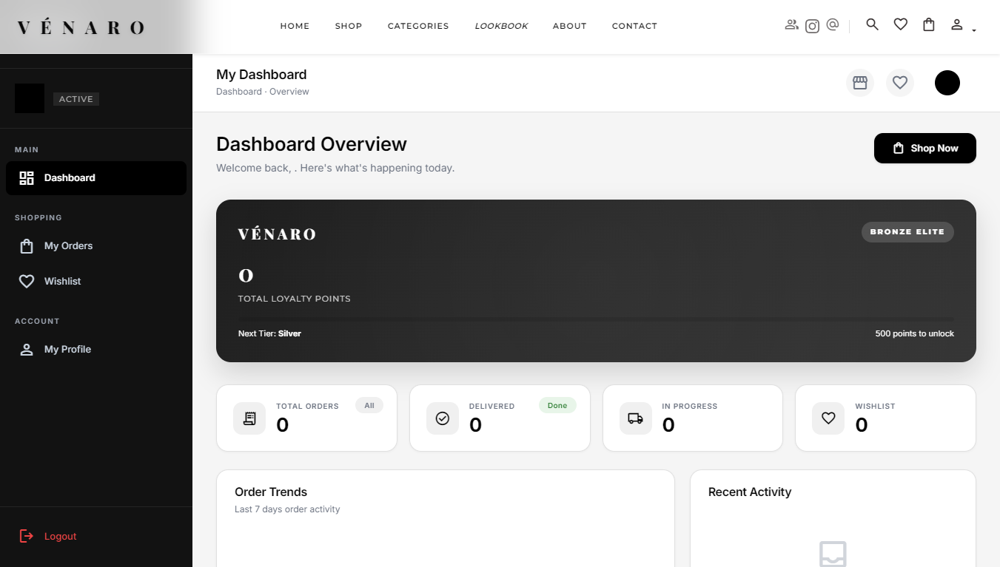
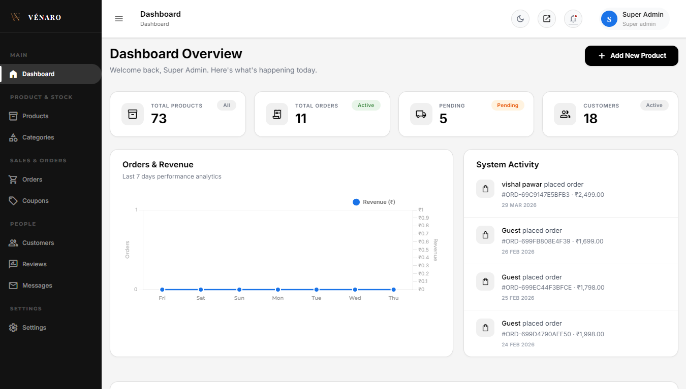

# 💎 VÉNARO — E-Commerce Website

<div align="center">
  
</div>

**A masterclass in full-stack web engineering. Built with PHP 8.2 & MySQL 8.0 for the modern luxury market.**

[](https://github.com/vishal-dev1128/VENARO-Ecommerce-Website)
[](https://php.net)
[](https://mysql.com)
[](./LICENSE)

[](https://github.com/vishal-dev1128/VENARO-Ecommerce-Website/actions)
[&logo=github-actions&style=flat-square)](https://github.com/vishal-dev1128/VENARO-Ecommerce-Website/security)

<br/>

[🚀 Quick Start](#-quick-start) &nbsp;·&nbsp; [📸 Extensive Gallery](#-extensive-visual-showcase) &nbsp;·&nbsp; [🛠️ Core Architecture](#-core-architecture--feature-ecosystem) &nbsp;·&nbsp; [🛡️ Security Posture](#-security-posture) &nbsp;·&nbsp; [📖 Documentation](#-technical-documentation)

---

</div>

## 🚀 Quick Start

### 📋 Prerequisites
Ensure your local development or production environment meets these strict requirements:
- **Web Server**: Apache 2.4.x (XAMPP 8.2+ highly recommended for Windows local devs)
- **Engine**: PHP 8.2.0 or higher
- **Database**: MySQL 8.0.x or MariaDB equivalent
- **Required PHP Extensions**: `pdo_mysql`, `mbstring`, `gd` (for image uploads and processing), `fileinfo`, `json`

### 🛠️ One-Minute Installation

1. **Clone the Repository**
   ```bash
   git clone https://github.com/vishal-dev1128/VENARO-Ecommerce-Website.git
   cd VENARO-Ecommerce-Website
   ```

2. **Initialize the Relational Database**
   - Head over to **phpMyAdmin** (`http://localhost/phpmyadmin`).
   - Create a fresh database named `venaro_db` (using `utf8mb4_general_ci` collation).
   - **Import** the schema located at `database/venaro_db.sql`.

3. **Configure Environment Variables**
   Open the root `config.php` file and securely map your local MySQL credentials:
   ```php
   <?php
   // Core Database Configuration
   define('DB_HOST', 'localhost');
   define('DB_NAME', 'venaro_db');
   define('DB_USER', 'your_username'); // Typically 'root' on local XAMPP
   define('DB_PASS', 'your_password'); // Typically '' on local XAMPP
   ?>
   ```

4. **Experience the Magic**
   Start Apache & MySQL in your control panel and navigate to:
   **`http://localhost/VENARO-Ecommerce-Website/`**

---

## 📸 Extensive Visual Showcase

A picture is worth a thousand lines of code. Explore every meticulously designed interface of the VÉNARO platform.

### User Journey & Website Flow
<table border="0" style="width: 100%; border-collapse: collapse;">
  <tr>
    <td align="center" width="50%" style="padding: 10px;">
      <a href="docs/screenshots/main page.png"></a>
      <br/><br/><sub><b>🏠 The Grand Entrance (Home)</b></sub>
    </td>
    <td align="center" width="50%" style="padding: 10px;">
      <a href="docs/screenshots/category page.png"></a>
      <br/><br/><sub><b>📂 Intelligent Category Browsing</b></sub>
    </td>
  </tr>
  <tr>
    <td align="center" width="50%" style="padding: 10px;">
      <a href="docs/screenshots/new arrival page.png"></a>
      <br/><br/><sub><b>✨ Highlighted New Arrivals</b></sub>
    </td>
    <td align="center" width="50%" style="padding: 10px;">
      <a href="docs/screenshots/products page.png"></a>
      <br/><br/><sub><b>🛍️ Curated Collections (Shop)</b></sub>
    </td>
  </tr>
  <tr>
    <td align="center" width="50%" style="padding: 10px;">
      <a href="docs/screenshots/product detail page.png"></a>
      <br/><br/><sub><b>🔍 Immersive Discovery (Detail)</b></sub>
    </td>
    <td align="center" width="50%" style="padding: 10px;">
      <a href="docs/screenshots/cart page.png"></a>
      <br/><br/><sub><b>🛒 Smart Cart System</b></sub>
    </td>
  </tr>
  <tr>
    <td align="center" width="50%" style="padding: 10px;">
      <a href="docs/screenshots/checkout page.png"></a>
      <br/><br/><sub><b>💳 Frictionless Checkout</b></sub>
    </td>
    <td align="center" width="50%" style="padding: 10px;">
      <a href="docs/screenshots/order confirm page.png"></a>
      <br/><br/><sub><b>✅ Success Validation</b></sub>
    </td>
  </tr>
  <tr>
    <td align="center" width="50%" style="padding: 10px;">
      <a href="docs/screenshots/about page.png"></a>
      <br/><br/><sub><b>📖 Brand Storytelling (About)</b></sub>
    </td>
    <td align="center" width="50%" style="padding: 10px;">
      <a href="docs/screenshots/contact page.png"></a>
      <br/><br/><sub><b>📬 Premium Contact Form</b></sub>
    </td>
  </tr>
  <tr>
    <td align="center" width="50%" style="padding: 10px;">
      <a href="docs/screenshots/user-dashboard.png"></a>
      <br/><br/><sub><b>👤 Personal Style Profile & History</b></sub>
    </td>
    <td align="center" width="50%" style="padding: 10px;">
      <a href="docs/screenshots/login and signup page.png"></a>
      <br/><br/><sub><b>🔐 Secure Login & Registration</b></sub>
    </td>
  </tr>
  <tr>
    <td colspan="2" align="center" style="padding: 10px;">
      <a href="docs/screenshots/admin-dashboard.png"></a>
      <br/><br/><sub><b>⚙️ The Command Center (Admin Analytics & Management)</b></sub>
    </td>
  </tr>
</table>

---

## 🛠️ Core Architecture & Feature Ecosystem

**VÉNARO** isn't just a visual template; it's a monolithic, state-of-the-art PHP engine crafted for high availability, security, and extreme performance in the luxury sector.

### 🛍️ Client-Facing Innovations

| Module | Technical Implementation |
|:---|:---|
| **Zero-Latency Predictive Search** | Utilizes an asynchronous `fetch` API communicating via JSON endpoints to deliver sub-100ms product suggestions directly from indexed MySQL tables. |
| **Session-Persistent Cart & Wishlist** | Advanced PHP session handling paired with database fallbacks ensures user cart data survives browser restarts and cross-device authentications. |
| **Dynamic Coupon Engine** | A micro-service logic layer verifying code validity, expiry constraints, minimum cart thresholds, and applying complex percentage or flat-rate logic on the fly. |
| **Asynchronous Reviews** | Verified buyers can leave star-rated feedback processed via AJAX, preventing page reloads and dramatically improving UX fluidity. |
| **Adaptive Layout Matrix** | A custom CSS methodology ensuring pixel-perfect rendering from ultra-wide 4K monitors down to mobile viewports without relying on heavy frameworks like Bootstrap. |

### 🔒 Operational Command (Admin)

| Capability | Scope & Power |
|:---|:---|
| **Multi-Faceted Product Forge** | Upload up to 5 multi-angle HD images simultaneously. Core engine auto-generates thumbnails, sanitizes file names, and strictly enforces MIME type security (JPG/PNG/WEBP only). |
| **Comprehensive Order Lifecycle** | Track transactions visually from '*Pending*' → '*Processing*' → '*Shipped*' → '*Delivered*'. Generate instant PDF-ready invoices on demand. |
| **Granular Inventory Taxonomy** | Build infinite hierarchies using Categories, sub-categories, and distinct thematic Collections (e.g., "Summer '25", "Exclusive Gold"). |
| **Customer Intelligence Hub** | Monitor registered user lifespans, track cumulative lifetime value (LTV), review total order counts, and manage account statuses. |
| **Global Environment Configuration** | Update store nomenclature, contact directives, tax logic, and operational parameters safely from a centralized GUI rather than modifying code. |

---

## 🛡️ Security Posture

In modern e-commerce, data integrity is everything. VÉNARO is fortified against the OWASP Top 10 web vulnerabilities.

- **🛡️ SQL Injection (SQLi) Immunity**: 100% of database interactions are funneled through **PDO (PHP Data Objects) Prepared Statements**. User input is mathematically isolated from query structure.
- **🔐 Cryptographic Password Storage**: We utilize the industry gold standard **Bcrypt (Blowfish)** algorithm via PHP's native `password_hash()` and `password_verify()`. Plaintext passwords never touch the DB.
- **🕯️ Defeating Session Hijacking**: Implementation of strict `session_regenerate_id(true)` upon privilege escalation (login/logout), completely neutralizing session fixation attacks.
- **🧹 Rigorous Data Sanitization**: Deep HTML entity encoding (`htmlspecialchars`) applied to all user-generated content prior to rendering, effectively eliminating **XSS (Cross-Site Scripting)** vectors.
- **🛑 Physical Access Guards**: Route-level middleware ensures that unauthenticated actors attempting to access the `/admin/` directory are immediately hard-redirected via Header manipulation.
- **🤖 Automated CI/CD Oversight**: This repository enforces continuous integration. Every push triggers **GitHub Actions** running **CodeQL Advanced Security Scans** and deep PHP syntax linting.

---

## 🗂️ Engineering Anatomy (Folder Structure)

A meticulously organized application structure designed for scaling teams.

```text
VENARO-Ecommerce-Website/
├── .github/                # Automation, CI/CD pipelines & Security Ops mapping
│   ├── workflows/          # GitHub Actions (Linting + Advanced CodeQL Scans)
│   └── ISSUE_TEMPLATE/     # Professional triage for bugs & feature ingestion
├── admin/                  # [RESTRICTED] Administrative Command Center
│   ├── includes/           # Server-side partials specific to admin views
│   └── assets/             # Admin-exclusive CSS/JS bundles
├── api/                    # AJAX JSON Endpoint Layer (Headless-ready architecture)
├── assets/                 # Universal Frontend Delivery Network
│   ├── css/                # Custom Premium Styling (Vanilla, highly optimized)
│   └── js/                 # Modular Vanilla JavaScript bridging DOM & API
├── database/               # Relational SQL Schema and Initial Seeding Data
├── docs/                   # Brand Assets, High-Res Screenshots & Markdown Wiki
├── includes/               # Reusable View Logic (Authentication, Navigation, Footers)
├── uploads/                # Dynamic Media Storage for Product & Platform Imagery
├── config.php              # Global Single-Source-of-Truth for Data Connectivity
├── .htaccess               # Apache Redirection, URL Masking & Security Headers
├── LICENSE                 # Public MIT Licensing Definition
└── README.md               # You are exploring this document right now
```

---

## 📖 Technical Documentation

For software engineers, DevOps, and administrators aiming to fork, extend, or deeply understand VÉNARO, refer to our highly detailed internal markdown wiki:

- **[🏗️ System Architecture & Data Modeling](./docs/wiki/Architecture.md)**: Deep dive into the entity-relationship diagrams and structural patterns.
- **[🔌 Headless API Reference](./docs/wiki/API-Reference.md)**: Comprehensive technical specs, payload expectations, and response schemas for all AJAX service endpoints.
- **[⚙️ Admin Operations Guide](./docs/wiki/Admin-Guide.md)**: The ultimate playbook for managing the e-commerce lifecycle efficiently.

---

## 🤝 Contributing & Global Community

VÉNARO thrives on community innovation. If you're a developer looking to improve the core logic or optimize the frontend, join us!

1. **Fork** the repository and create your feature branch: `git checkout -b feature/Optimization-Engine`
2. Write clean, documented PHP 8 code adhering to modern PSR standards.
3. Commit your changes logically: `git commit -m 'feat: optimize predictive search indexing'`
4. Push to your branch and submit a **Pull Request**.

---

## 📜 Legal & Credits

- **License**: Strictly **All Rights Reserved**. Portfolio and demonstration use only.
- **Architect & Author**: Engineered with absolute precision by **Vishal**.
- **Usage Notice**: Unauthorized copying, modification, or distribution is prohibited without written consent from the author.

<br/>

<div align="center">

**VÉNARO — Define Your Luxury. Engineer Your Success.**

&copy; 2025 VÉNARO Premium E-Commerce. All Rights Reserved.

</div>
